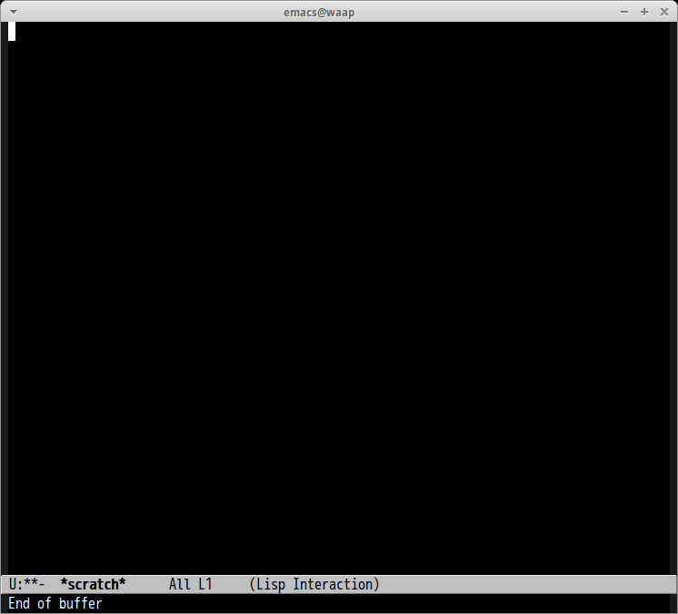

# helm-commit-m

[commit-m](http://commit-m.minamijoyo.com/) with helm-interface.

## Screenshot

## Commands

### `M-x helm-commit-m`

You can select page by prefix argument.

#### Actions

1. Browse commit URL
2. Insert commit message
